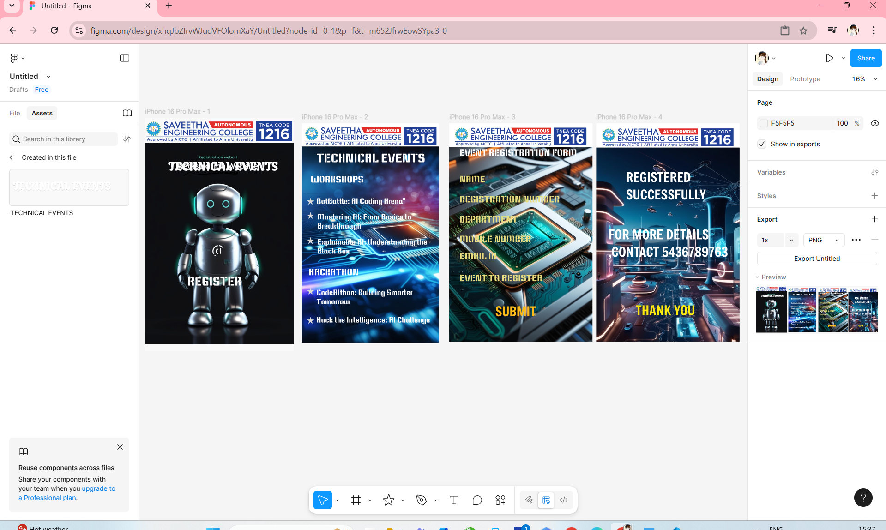

# Ex09 Event Registration Web Application
## Date:18-05-2025

## AIM:
To design, develop and deploy a web application for event registration.

## DESIGN STEPS:

### Step 1:
Create a new frame.

### Step 2:
Select any one preset size of your choice.

### Step 3:
Select the shapes you need.

### Step 4:
Import images as needed.

### Step 5:
Create pages based on your need and link them.

### Step 6:

Validate the HTML and CSS code.

### Step 6:

Publish the website in the given URL.

## DESIGN TOOL:
Figma

## CODE:
```
HOME PAGE

(HTML CODE)

</path>
</svg>
<div class="text--0-">TECHNICAL EVENTS</div>
<div class="container--0-"></div>
<div class="text--0-">REGISTER</div>

(CSS CODE)

.text--0- {
  width: 685px;
  height: 182px;
  color: #ffffff;
  border-width: 1px;
  border-style: solid;
  border-color: #000000;
  font-size: 128px;
  font-family: Keania One, "Regular";
  font-weight: 400;
  text-align: left;
  vertical-align: top;
}
.container--0- {
  position: absolute;
  left: 214px;
  top: 576px;
  width: 1349px;
  height: 193px;
  background-color: #ffffff;
  justify-content: start;
  align-items: start;
}

EVENTS PAGE

(HTML CODE)


<div class="text--0-">TECHNICAL EVENTS</div>
<div class="text--0-">Mastering AI: From Basics to Breakthrough</div>
<div class="text--0-">CodeAIthon: Building Smarter Tomorrow</div>
<div class="text--0-">Hack the Intelligence: AI Challenge</div>
<div class="text--0-">Explainable AI: Understanding the Black Box</div>
<div class="text--0-">WORKSHOPS</div>
<div class="text--0-">HACKATHON</div>
<div class="text--0-">BotBattle: AI Coding Arena"</div>
<svg
  width="79"
  height="74"
  viewBox="0 0 79 74"
  fill="none"
  xmlns="http://www.w3.org/2000/svg"
>
  <path
    d="M39.5 0L48.5928 27.9848L78.0178 27.9848L54.2125 45.2804L63.3053 73.2652L39.5 55.9696L15.6947 73.2652L24.7875 45.2804L0.982212 27.9848L30.4072 27.9848L39.5 0Z"
    fill="#D9D9D9"
  ></path></svg
><svg
  width="79"
  height="74"
  viewBox="0 0 79 74"
  fill="none"
  xmlns="http://www.w3.org/2000/svg"
>
  <path
    d="M39.5 0L48.5928 27.9848L78.0178 27.9848L54.2125 45.2804L63.3053 73.2652L39.5 55.9696L15.6947 73.2652L24.7875 45.2804L0.982212 27.9848L30.4072 27.9848L39.5 0Z"
    fill="#D9D9D9"
  ></path></svg
><svg
  width="79"
  height="74"
  viewBox="0 0 79 74"
  fill="none"
  xmlns="http://www.w3.org/2000/svg"
>
  <path
    d="M39.5 0L48.5928 27.9848L78.0178 27.9848L54.2125 45.2804L63.3053 73.2652L39.5 55.9696L15.6947 73.2652L24.7875 45.2804L0.982212 27.9848L30.4072 27.9848L39.5 0Z"
    fill="#D9D9D9"
  ></path></svg
><svg
  width="79"
  height="74"
  viewBox="0 0 79 74"
  fill="none"
  xmlns="http://www.w3.org/2000/svg"
>
  <path
    d="M39.5 0L48.5928 27.9848L78.0178 27.9848L54.2125 45.2804L63.3053 73.2652L39.5 55.9696L15.6947 73.2652L24.7875 45.2804L0.982212 27.9848L30.4072 27.9848L39.5 0Z"
    fill="#D9D9D9"
  ></path></svg
><svg
  width="79"
  height="74"
  viewBox="0 0 79 74"
  fill="none"
  xmlns="http://www.w3.org/2000/svg"
>
  <path
    d="M39.5 0L48.5928 27.9848L78.0178 27.9848L54.2125 2804L0.982212 27.9848L30.4072 27.9848L39.5 0Z"
    fill="#D9D9D9"
  ></path>
</svg>

(CSS CODE)

.text--0- {
  width: 953px;
  height: 97px;
  color: #ffffff;
  font-size: 80px;
  font-family: Keania One, "Regular";
  font-weight: 400;
  text-align: left;
  vertical-align: top;
}

REGISTRATION PAGE

(HTML CODE)


<div class="text--0-">EVENT REGISTRATION FORM</div>
<div class="text--0-">NAME</div>
<div class="text--0-">REGISTRATION NUMBER</div>
<div class="text--0-">DEPARTMENT</div>
<div class="text--0-">EMAIL ID</div>
<div class="text--0-">MOBILE NUMBER</div>
<div class="text--0-">EVENT TO REGISTER</div>
<div class="text--0-">SUBMIT</div>

(CSS CODE)

.text--0- {
  width: 437px;
  height: 186px;
  color: #ffba19;
  font-size: 140px;
  font-family: Freeman, "Regular";
  font-weight: 400;
  text-align: left;
  vertical-align: top;
}


CONTACT PAGE

(HTML CODE)


<div class="text--0-">REGISTERED SUCCESSFULLY</div>
<div class="text--0-">FOR MORE DETAILS ,CONTACT 5436789763</div>
<div class="text--0-">THANK YOU</div>

(CSS CODE)

.text--0- {
  width: 635px;
  height: 186px;
  color: #ffeb0e;
  font-size: 140px;
  font-family: Freeman, "Regular";
  font-weight: 400;
  text-align: left;
  vertical-align: top;
}

```
## OUTPUT:


## RESULT:
The program to design, develop and deploy a web application for event registration is completed successfully.
